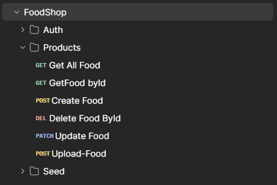

<p align="center">
  <a href="http://nestjs.com/" target="blank"></a>
</p>

# 🍔 FoodSHOP REST API

An enterprise-grade REST API designed for Food Delivery and E-commerce platforms. It features a secure role-based access control (RBAC) system (Admin, Client, etc.), secure authentication, and a dedicated module for product image uploads.

## 🛠️ Tech Stack
* **Backend Framework:** NestJS (TypeScript)
* **Authentication:** JWT (JSON Web Tokens) 
* **File Storage:** Local Server Storage (Multer)
* **Database:** PostgreSQL

## ✨ Key Features
* **Role-Based Access Control (RBAC):** Protected routes ensuring only authorized admins can create or modify products.
* **File Management:** Strict validation and secure upload system for the food menu images.
* **Database Seeding:** Special seed endpoint to populate the database with mock store products instantly.

## 📸 Postman Collection Structure


<details>
<summary><b>📐 View Endpoints Details (Click to expand)</b></summary>

### 🔐 Authentication (`/api/auth`)
* `POST /register` - Register a new client.
* `POST /login` - Sign in and receive a JWT token.

### 🍔 Products & Menu (`/api/products`)
* `GET /` - Retrieve all food items.
* `GET /:id` - Get a specific food item by its ID.
* `POST /` - Create a new product `[Admin Role Required]`.
* `PATCH /:id` - Update product details `[Admin Role Required]`.
* `DELETE /:id` - Remove a product from the menu `[Admin Role Required]`.
* `POST /upload` - Upload a food menu image via multipart/form-data `[Admin Role Required]`.

### 🌱 Database Seeding (`/api/seed`)
* `GET /food` - Populates the database with mock store products.

</details>

## ⚙️ Local Setup Instructions

1. **Clone the repository:**
```bash
   git clone https://github.com/Carlosmarrano/Food-shop.git
   cd Food-shop
```

2. **Install dependencies:**

```Bash
   npm install
```

3. **Environment Setup:**
```
Copy .env.template and rename it to .env.

Configure your database credentials and JWT secret keys.
```

4. **Start the Database via Docker:**

```Bash
   docker-compose up -d
```

5. **Seed the Database:**
```
Send a GET request to the following URL to populate test products:
http://localhost:3000/api/seed/food
```

6. **Run the application:**

```Bash
   npm run start:dev
```